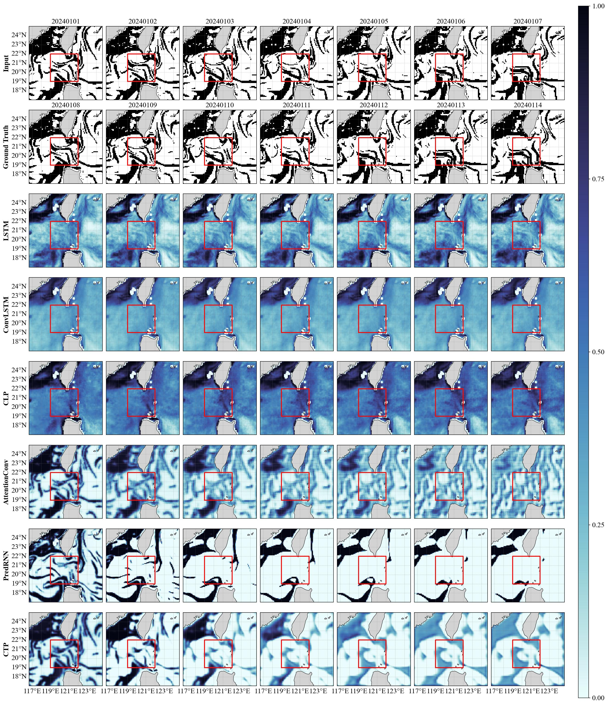

# CTP: Physics-Aware Ocean Front Prediction

Official implementation of:

> **Physics-Aware Modal Intensity Modeling for Dynamically Stable Ocean Front Prediction**  
> IEEE Journal of Oceanic Engineering (IEEE JOE), 2026.

---

## Overview

CTP is a physics-aware ocean front prediction framework for dynamically stable spatiotemporal forecasting of mesoscale ocean fronts.

The proposed framework combines:

- CNN-based spatial feature extraction
- Transformer-based temporal modeling
- Physics-informed regularization
- Modal intensity evolution modeling

to improve frontal structure preservation and recursive forecasting stability in dynamically complex ocean environments.

---

## Framework

<p align="center">
  
</p>

---

## Prediction Results

<p align="center">
  
</p>

The proposed framework demonstrates improved preservation of:

- frontal sharpness
- filament continuity
- mesoscale structures
- physically consistent evolution

compared with conventional recurrent forecasting models.

---

## Repository Structure

```text
CTP/
├── train.py
├── test.py
├── saved_models/
│   ├── SCS/
│   ├── KUR/
│   └── GSR/
├── framework.pdf
├── result.jpg
└── README.md
```

---

## Training

Run:

```bash
python train.py
```

---

## Testing

Run:

```bash
python test.py
```

---

## Pretrained Models

Pretrained models are provided for multiple regions:

- SCS (South China Sea)
- KUR (Kuroshio Extension Region)
- GSR (Gulf Stream Region)

All pretrained weights are stored in:

```text
saved_models/
```

---

## Features

- Physics-aware ocean front prediction
- CNN + Transformer hybrid architecture
- Physics-informed regularization
- Recursive rolling forecast
- Cross-region generalization
- Multi-step forecasting
- Dynamically stable frontal evolution

---

## Citation

If you find this work useful, please cite:

```bibtex
@article{wang2026ctp,
  title={Physics-Aware Modal Intensity Modeling for Dynamically Stable Ocean Front Prediction},
  author={Wang, Yishuo and Zhou, Muping},
  journal={IEEE Journal of Oceanic Engineering},
  year={2026}
}
```

---

## Code Availability

The source code and pretrained models are publicly available in this repository.

---

## License

This project is released under the MIT License.

---

## Acknowledgement

We thank the anonymous reviewers for their constructive comments and valuable suggestions.
